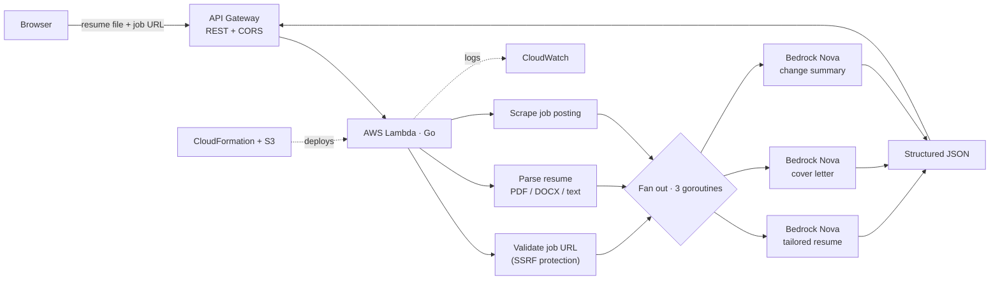

# Resume Customizer Service

An AI-powered serverless application that automatically customizes resumes and generates cover letters based on job postings. Built with AWS Lambda, API Gateway, and Amazon Bedrock Nova.

## Features

- **Resume Optimization**: Analyzes job descriptions and tailors your resume to match requirements
- **Cover Letter Generation**: Creates personalized cover letters for each application
- **Change Summary**: Provides detailed analysis of what was modified and why
- **Multi-format Support**: Handles PDF, DOCX, and plain text resume files
- **Web Scraping**: Automatically extracts job requirements from posting URLs — with SSRF protection
- **Serverless Architecture**: Scales automatically with zero infrastructure management

## Architecture



### AWS Services Used
- **Lambda**: Go-based function for resume processing and AI generation
- **API Gateway**: RESTful API with CORS support
- **Bedrock Nova**: AI model for content generation and optimization (model: `us.amazon.nova-lite-v1:0`)
- **S3**: Storage for Lambda code and CloudFormation templates
- **CloudWatch**: Logging and monitoring
- **IAM**: Security and permissions management

### System Flow
1. User uploads resume file and job URL via API
2. Lambda function validates the job URL (SSRF protection)
3. Lambda function parses resume (PDF/DOCX/text)
4. Web scraper extracts and cleans job description from URL
5. Amazon Bedrock Nova generates optimized resume, cover letter, and change summary concurrently
6. Results returned as structured JSON response

### Project Structure
```
cmd/
  lambda/
    main.go              # Lambda entry point and request routing
internal/
  ai/
    bedrock.go           # Bedrock/Nova client and invocation
    prompt.go            # Prompt templates
  handler/
    customize.go         # POST /api/customize-resume handler
    health.go            # GET /health handler
    types.go             # Request/response structs
  parser/
    parse.go             # Top-level file parsing dispatcher
    pdf.go               # PDF text extraction
    docx.go              # DOCX text extraction
    text.go              # Plain-text detection and file-type detection
  scraper/
    scraper.go           # Job description fetcher + SSRF validation
    clean.go             # HTML stripping, line filtering, truncation
  util/
    cors.go              # CORS headers constant
    text.go              # NormalizeRequest, MatchesPath, name/job extraction
go.mod                   # Go module definition
go.sum                   # Dependency checksums
Makefile                 # Build and deployment convenience commands
deploy.sh                # Deployment automation script
params.json              # CloudFormation parameters
main.yaml                # Root CloudFormation template
lambda.yaml              # Lambda function and IAM resources
api.yaml                 # API Gateway configuration
```

## API Endpoints

### POST `/api/customize-resume`
Customizes a resume for a specific job posting.

**Request body:**
```json
{
  "resume": "<base64-encoded file content>",
  "jobUrl": "https://company.com/jobs/123",
  "fileName": "resume.pdf"
}
```

**Success response (200):**
```json
{
  "resume": "<optimized resume, marker format>",
  "coverLetter": "<generated cover letter, marker format>",
  "changes": "<change summary, marker format>",
  "metadata": {
    "name": "John Doe",
    "company": "Target Company",
    "position": "Software Engineer"
  }
}
```

#### Marker format reference

Each text field in the response uses a line-oriented marker format:

**`resume`**
```
NAME: <Full Name>
CONTACT: <Email | Phone | LinkedIn | Location>
SECTION: <SECTION NAME>
SUMMARY_TEXT: <Brief summary>
COMPANY: <Company> | <Location> | <Dates>
TITLE: <Job Title>
BULLET: • <Achievement with metrics>
EDUCATION: <Degree> | <School> | <Year>
SKILL_CATEGORY: <Category>: <skills>
```

**`coverLetter`**
```
HEADER: <Name>
ADDRESS: <Email | Phone | City, State>
DATE: <Month DD, YYYY>
EMPLOYER: Hiring Manager
EMPLOYER: <Company>
SUBJECT: Re: <Position> Position
BODY_PARAGRAPH: <paragraph text>
CLOSING: Sincerely,
CLOSING: <Name>
```

**`changes`**
```
METRICS: <summary, e.g. "Added 5 keywords • Enhanced 8 bullets">
CHANGE: <change title>
BEFORE: <original text>
AFTER: <optimized text>
```

**Error responses:**

| Status | Condition |
|--------|-----------|
| 400 | Malformed JSON, missing required fields (`resume`/`jobUrl`), or invalid/private job URL (SSRF protection) |
| 422 | Job description scraped successfully but no company name or job title could be extracted |
| 500 | AI service unavailable, resume parse failure, or unexpected scraping error |

### GET `/health`
Health check endpoint.

**Response (200):**
```json
{"status":"ok","service":"resume-customizer","timestamp":"2024-01-01T00:00:00Z"}
```

## Prerequisites

- AWS CLI configured with appropriate permissions
- Go 1.24+
- Make (optional, for convenience commands)

### Required AWS Permissions
- CloudFormation stack management
- Lambda function deployment
- S3 bucket creation and management
- API Gateway configuration
- Bedrock model access (Nova Lite — `us.amazon.nova-lite-v1:0`)
- IAM role creation

## Deployment

### Quick Start
1. **Clone and configure:**
   ```bash
   git clone <repository>
   cd resume-generator-backend
   export AWS_PROFILE=your-profile
   ```

2. **Deploy everything:**
   ```bash
   make deploy
   ```

3. **Get API endpoint:**
   ```bash
   make outputs
   ```

### Manual Deployment
```bash
# Initialize Go dependencies
make init

# Build Lambda function
make build

# Deploy infrastructure
./deploy.sh deploy

# Check deployment status
make status
```

### Configuration Options

Environment variables can be set in `params.json` or via command line:

```bash
# Custom deployment
AWS_PROFILE=myprofile STACK_NAME=MyResumeStack make deploy

# Deploy to different environment
make staging-deploy    # or make prod-deploy
```

### Available Make Commands
- `make help` - Show all available commands
- `make build` - Build Go Lambda function
- `make test` - Run Go tests
- `make deploy` - Full deployment
- `make update-lambda` - Update only Lambda code
- `make logs` - View Lambda logs
- `make status` - Check stack status
- `make outputs` - Show API endpoints
- `make clean` - Remove build artifacts

## Development

### Local Testing
```bash
# Run tests (CGO_ENABLED=0 matches the Lambda build)
CGO_ENABLED=0 go test ./...

# Build locally
make dev-build

# Quick code deployment
make dev-deploy
```

### Debugging
```bash
# View real-time logs
make logs

# Check stack events
aws cloudformation describe-stack-events --stack-name ResumeCustomizerStack
```

## Configuration

### Key Parameters (params.json)
- `LambdaTimeout`: Function timeout (default: 60s)
- `LambdaMemorySize`: Memory allocation (default: 512MB)
- `CorsOrigin`: CORS policy (default: "*")

### Environment Variables
Set in Lambda environment:

| Variable | Default | Description |
|----------|---------|-------------|
| `ENVIRONMENT` | — | Deployment label (dev/staging/prod). Informational only; does not change runtime behavior. |
| `JD_MAX_LENGTH` | `8000` | Maximum character length of the cleaned job description sent to the AI. Set lower to reduce token usage, or higher to preserve more context. Must be a positive integer. |

## Security

- No hardcoded credentials or API keys
- IAM roles with least privilege access
- SSRF protection: job URLs are validated to block private/reserved IP ranges (RFC 1918, link-local, loopback, cloud metadata at 169.254.169.254) and non-HTTP schemes; redirects are validated at each hop
- CORS configured for web access
- S3 buckets with versioning enabled
- CloudWatch logging for audit trails

## Supported File Formats

- **PDF**: Full text extraction using `ledongthuc/pdf`
- **DOCX**: Text extraction via ZIP+XML parsing of `word/document.xml` (no external dependencies)
- **Plain Text**: Direct processing

## Cost Optimization

- ARM64 Lambda for better price/performance
- Pay-per-request pricing model
- 14-day log retention
- Optimized memory allocation

## Troubleshooting

### Common Issues
1. **Deployment fails**: Check AWS credentials and permissions
2. **Lambda timeout**: Increase timeout in params.json
3. **Job scraping fails**: URL may be behind authentication or have anti-bot protection
4. **PDF parsing errors**: Ensure file is not password-protected or corrupted
5. **422 on valid job URL**: The job page may not include explicit "Company:" or "Position:" labels in the first 15 lines of text — try a direct listing URL rather than a search results page

### Debug Commands
```bash
# Check AWS configuration
make check-aws

# Validate templates before deployment
make validate

# View detailed logs
aws logs tail /aws/lambda/ResumeCustomizerStack-ResumeCustomizerFunction --follow
```

## Contributing

1. Fork the repository
2. Create a feature branch
3. Make changes and run `CGO_ENABLED=0 go test ./...`
4. Submit a pull request

## License

This project is open source. See LICENSE file for details.

## Support

For issues and questions:
- Check CloudWatch logs for error details
- Review AWS CloudFormation console for deployment issues
- Ensure Bedrock Nova Lite access is enabled in your AWS account
